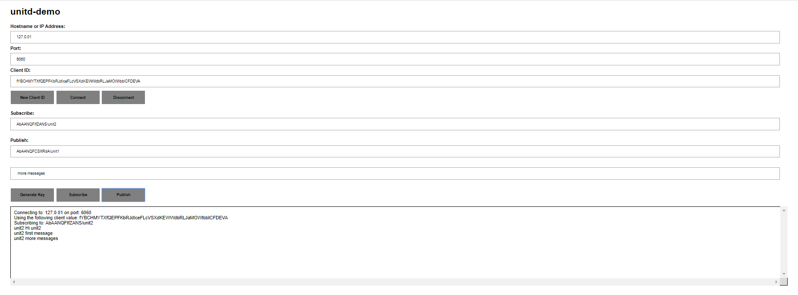

# unitdb [](https://pkg.go.dev/github.com/unit-io/unitdb) [](https://goreportcard.com/report/github.com/unit-io/unitdb) [](https://coveralls.io/github/unit-io/unitdb?branch=master)

<p align="left">
   
</p>

# unitdb: blazing fast time-series database for IoT and real-time messaging applications

unitdb is blazing fast time-series database for IoT, realtime messaging  applications. Access unitdb with pubsub over tcp or websocket using [unitd](https://github.com/unit-io/unitd) application.

unitdb can be used for online gaming and mobile apps as it satisfy the requirements for low latency and binary messaging. unitdb is a perfect time-series database for applications such as internet of things and internet connected devices.

# About unitdb 

## Key characteristics
- 100% Go
- Optimized for fast lookups and writes
- Can store larger-than-memory data sets
- Data is safely written to disk with accuracy and high performant block sync technique
- Supports opening database with immutable flag
- Supports data encryption
- Supports time-to-live on message entry
- Supports writing to wildcard topics
- Queried data is returned complete and correct

The unitdb engine handles data from the point put request is received through writing data to the physical disk. Data is written to unitdb using low latency binary messaging entry. Data is compressed and encrypted (if encryption is set) then written to a WAL for immediate durability. Entries are written to memdb block cache and become immediately queryable. The memdb block cache is periodically written to disk in the form of blocks and after data is stored safely in files, the WAL is truncated and memdb is shrink.

The unitdb engine includes the following components:

- Buffer Pool
- Block Cache
- Write Ahead Log (WAL)
- Lookup Trie
- Writing to timeWindow file
- Writing to Block Index file
- Writing to Data file

## Quick Start
To build unitdb from source code use go get command.

> go get -u github.com/unit-io/unitdb

## Usage

The unitdb support Get, Put, Delete operations. It also support encryption, batch operations, group batch operations, and writing to wildcard topics. See complete [usage guide](https://github.com/unit-io/unitdb/tree/master/docs/usage/advanced.md) for more advanced use case. 

### Opening a database

To open or create a new database, use the unitdb.Open() function:

```

	package main

	import (
		"log"

		"github.com/unit-io/unitdb"
	)

	func main() {
		// Opening a database.
		opts := &unitdb.Options{BufferSize: 1 << 27, MemdbSize: 1 << 32, LogSize: 1 << 30, MinimumFreeBlocksSize: 1 << 27}
		flags := &unitdb.Flags{Immutable: true}
		db, err := unitdb.Open("unitdb", flags, opts)
		if err != nil {
			log.Fatal(err)
			return
		}	
		defer db.Close()
	}

```

### Writing to a database

#### Store a message
Use DB.Put() to store message to a topic or use DB.PutEntry() to store message entry to a topic. DB.PutEntry() allows client to specify ID and Contract parameters. 

```

	topic := []byte("unit8.b.b1")
	msg := []byte("msg.b.b1.1")
	db.Put(topic, msg)

	or
	
	db.PutEntry(unitdb.NewEntry(topic, msg))

```

#### Specify ttl 
Specify ttl parameter to a topic while storing messages to expire it after specific duration. DB query does not fetch expired messages. 

```
	topic := []byte("unit8.b.b1?ttl=1h")
	msg := []byte("msg.b.b1.1")
	b.PutEntry(unitdb.NewEntry(topic, msg))

```

#### Read messages
Use DB.Get() to read messages from a topic. Use last parameter to specify duration or specify number of recent messages to read from a topic. for example, "last=1h" gets messages from unitdb stored in last 1 hour, or "last=100" to get last 100 messages from unitdb. Specify an optional parameter Query.Limit to retrieve messages from a topic with a limit.

```

	var err error
	var msg [][]byte
	msgs, err = db.Get(&unitdb.Query{Topic: []byte("unit8.b.b1?last=100")})
    ....
	msgs, err = db.Get(&unitdb.Query{Topic: []byte("unit8.b.b1?last=1h", Limit: 100}))

```

#### Deleting a message
Deleting a message in unitdb is rare and it require additional steps to delete message from a given topic. Generate a unique message ID using DB.NewID() and use this unique message ID while putting message to the unitdb using DB.PutEntry(). To delete message provide message ID to the DB.DeleteEntry() function. If Immutable flag is set when DB is open then DB.DeleteEntry() returns an error.

```

	messageId := db.NewID()
	err := db.PutEntry(&unitdb.Entry{
		ID:       messageId,
		Topic:    []byte("unit8.b.b1"),
		Payload:  []byte("msg.b.b1.deleting"),
	})
	
	err := db.DeleteEntry(&unitdb.Entry{
		ID:       messageId,
		Topic:    []byte("unit8.b.b1"),
	})

```

#### Topic isolation
Topic isolation can be achieved using Contract while putting messages into unitdb or querying messages from a topic. Use DB.NewContract() to generate a new Contract and then specify Contract while putting messages using DB.PutEntry() method. Use Contract in the query to get messages from a topic specific to the contract.

```
	contract, err := db.NewContract()

	messageId := db.NewID()
	err := db.PutEntry(&unitdb.Entry{
		ID:       messageId,
		Topic:    []byte("unit8.b.b1"),
		Payload:  []byte("msg.b.b1.1"),
		Contract: contract,
	})
	....
	msgs, err := db.Get(&unitdb.Query{Topic: []byte("unit8.b.b1?last=1h", Contract: contract, Limit: 100}))

```

### Iterating over items
Use the DB.Items() function which returns a new instance of ItemIterator. 
Specify topic to retrieve values and use last parameter to specify duration or specify number of recent messages to retrieve from the topic. for example, "last=1h" retrieves messages from unitdb stored in last 1 hour, or "last=100" to retrieves last 100 messages from the unitdb:

```

	func print(topic []byte, db *unitdb.DB) {
		// topic -> "unit8.b.b1?last=1h"
		it, err := db.Items(&unitdb.Query{Topic: topic})
		if err != nil {
			log.Fatal(err)
			return
	}
	for it.First(); it.Valid(); it.Next() {
		err := it.Error()
		if err != nil {
			log.Fatal(err)
			return
		}
		log.Printf("%s %s", it.Item().Topic(), it.Item().Value())
	}
}

```

### Statistics
The unitdb keeps a running metrics of internal operations it performs. To get unitdb metrics use DB.Varz() function.

```

	if varz, err := db.Varz(); err == nil {
		fmt.Printf("%+v\n", varz)
	}

```

## Example Web Application
To access unitdb using websocket build unitd from source code using go get command.

> go get -u github.com/unit-io/unitd && unitd

Open [unitd.html](https://github.com/unit-io/unitd/blob/master/examples/html/unitd.html) under example/html folder in a browser.

## Steps
- Generate Client ID
- Specify new client ID and connect to client
- Specify topics to subscribe/publish messages and generate key
- Specify key to the topics with separator '/' and subscribe to topic
- Specify message to send and publish to topic

### First Client
<p align="left">
   
</p>

### Second Client
<p align="left">
   
</p>

## Contributing
If you'd like to contribute, please fork the repository and use a feature branch. Pull requests are welcome.

## Licensing
Copyright (c) 2016-2020 Saffat IT Solutions Pvt Ltd. This project is licensed under [Affero General Public License v3](https://github.com/unit-io/unitdb/blob/master/LICENSE).
