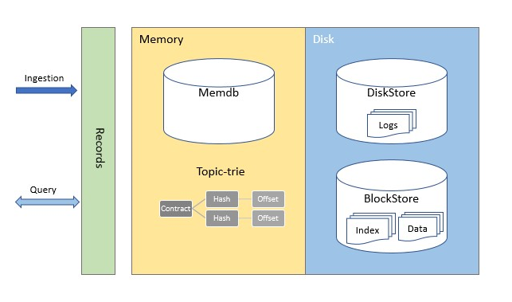
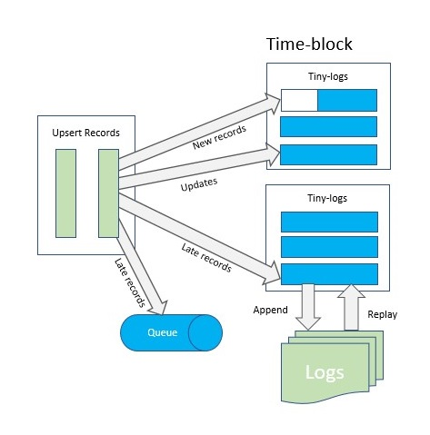

# unitdb [](https://pkg.go.dev/github.com/unit-io/unitdb) [](https://goreportcard.com/report/github.com/unit-io/unitdb) [](https://travis-ci.org/unit-io/unitdb) [](https://coveralls.io/github/unit-io/unitdb?branch=master)

Unitdb is blazing fast specialized time-series database for microservices, IoT, and realtime internet connected devices. As Unitdb satisfy the requirements for low latency and binary messaging, it is a perfect time-series database for applications such as internet of things and internet connected devices. The Unitdb Server uses uTP (unit Transport Protocol) for the Client Server messaging. Read [uTP Specification](https://github.com/unit-io/unitdb/tree/master/docs/utp.md).

```
Don't forget to ⭐ this repo if you like Unitdb!
```

# About unitdb 

## Key characteristics
- 100% Go
- Can store larger-than-memory data sets
- Optimized for fast lookups and writes
- Supports writing billions of records per hour
- Supports opening database with immutable flag
- Supports database encryption
- Supports time-to-live on message entries
- Supports writing to wildcard topics
- Data is safely written to disk with accuracy and high performant block sync technique

## Quick Start
To build Unitdb from source code use go get command.

> go get github.com/unit-io/unitdb

## Usage
Detailed API documentation is available using the [go.dev](https://pkg.go.dev/github.com/unit-io/unitdb) service.

Make use of the client by importing it in your Go client source code. For example,

> import "github.com/unit-io/unitdb"

Unitdb supports Get, Put, Delete operations. It also supports encryption, batch operations, and writing to wildcard topics. See [usage guide](https://github.com/unit-io/unitdb/tree/master/docs/usage.md). 

Samples are available in the examples directory for reference. To build unitdb client from latest source code use "replace" in go.mod to point to your local module.

```golang
go mod edit -replace github.com/unit-io/unitdb-go=$GOPATH/src/github.com/unit-io/unitdb-go
```

## Clustering
To bring up the Unitdb cluster start 2 or more nodes. For fault tolerance 3 nodes or more are recommended.

```
> ./bin/unitdb -listen=:6060 -grpc_listen=:6080 -cluster_self=one -db_path=/tmp/unitdb/node1
> ./bin/unitdb -listen=:6061 -grpc_listen=:6081 -cluster_self=two -db_path=/tmp/unitdb/node2
```

Above example shows each Unitdb node running on the same host, so each node must listen on different ports. This would not be necessary if each node ran on a different host.

## Architecture Overview
The unitdb engine handles data from the point put request is received through writing data to the physical disk. Data is compressed and encrypted (if encryption is set) then written to a WAL for immediate durability. Entries are written to memdb and become immediately queryable. The memdb entries are periodically written to log files in the form of blocks.

To efficiently compact and store data, the unitdb engine groups entries sequence by topic key, and then orders those sequences by time and each block keep offset of previous block in reverse time order. Index block offset is calculated from entry sequence in the time-window block. Data is read from data block using index entry information and then it un-compresses the data on read (if encryption flag was set then it un-encrypts the data on read).

<p align="left">
  
</p>

Unitdb stores compressed data (live records) in a memdb store. Data records in a memdb are partitioned into (live) time-blocks of configured capacity. New time-blocks are created at ingestion, while old time-blocks are appended to the log files and later sync to the disk store.

When Unitdb receives a put or delete request, it first writes records into tiny-log for recovery. Tiny-logs are added to the log queue to write it to the log file. The tiny-log write is triggered by the time or size of tiny-log incase of backoff due to massive loads. 

The tiny-log queue is maintained in memory with a pre-configured size, and during massive loads the memdb backoff process will block the incoming requests from proceeding before the tiny-log queue is cleared by a write operation. After records are appended to the tiny-log, and written to the log files the records are then sync to the disk store using blazing fast block sync technique.

<p align="left">
  
</p>

## Next steps
In the future, we intend to enhance the Unitdb with the following features:

- Distributed design: We are working on building out the distributed design of Unitdb, including replication and sharding management to improve its scalability.
- Developer support and tooling: We are working on building more intuitive tooling, refactoring code structures, and enriching documentation to improve the onboarding experience, enabling developers to quickly integrate Unitdb to their time-series database stack.

## Contributing
As Unitdb is under active development and at this time Unitdb is not seeking major changes or new features; however, small bugfixes are encouraged. Unitdb is seeking contibution to improve test coverage and documentation.

## Licensing
This project is licensed under [Apache-2.0 License](https://github.com/unit-io/unitdb/blob/master/LICENSE).
