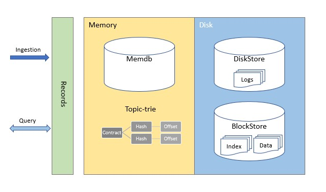
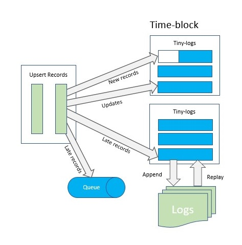

# unitdb [](https://pkg.go.dev/github.com/unit-io/unitdb) [](https://goreportcard.com/report/github.com/unit-io/unitdb)

Unitdb is blazing fast specialized time-series database for microservices, IoT, and realtime internet connected devices. As Unitdb satisfy the requirements for low latency and binary messaging, it is a perfect time-series database for applications such as internet of things and internet connected devices. The Unitdb Server uses uTP (unit Transport Protocol) for the Client Server messaging. Read [uTP Specification](https://github.com/unit-io/unitdb/tree/master/docs/utp.md).

```
Don't forget to ⭐ this repo if you like Unitdb!
```

# About unitdb 

## Key characteristics
- 100% Go
- Can store larger-than-memory data sets
- Optimized for fast lookups and writes
- Supports writing billions of records per hour
- Supports opening database with immutable flag
- Supports database encryption
- Supports time-to-live on message entries
- Supports writing to wildcard topics
- Data is safely written to disk with accuracy and high performant block sync technique

## Quick Start
To build Unitdb from source code use go get command.

> go get github.com/unit-io/unitdb

## Usage
Detailed API documentation is available using the [go.dev](https://pkg.go.dev/github.com/unit-io/unitdb) service.

Make use of the client by importing it in your Go client source code. For example,

> import "github.com/unit-io/unitdb"

Unitdb supports Get, Put, Delete operations. It also supports encryption, batch operations, and writing to wildcard topics. See [usage guide](https://github.com/unit-io/unitdb/tree/master/docs/usage.md). 

Samples are available in the examples directory for reference.

## Running the server
The server signs client IDs and topic keys with a key only it knows, and refuses to start without one. Generate a key and set it as `encryption_config`'s `key` in `unitdb.conf`, or in the `UNITDB_ENCRYPTION_KEY` environment variable:

```
> export UNITDB_ENCRYPTION_KEY=$(openssl rand -base64 24)
```

Up to v0.3 the sample `unitdb.conf` shipped with a key, which the server now refuses: it is public, so anyone could sign client IDs and topic keys with it. A deployment that ran with it needs a new key, and its clients new client IDs and topic keys.

### Keyring and key rotation
The single key is a keyring of one key. To rotate keys, give the server a keyring instead, in the `UNITDB_KEYRING` environment variable or in a file named by `encryption_config`'s `keyring_file`: a JSON list of keys, each with an id from 0 to 255, 32 random bytes in base64 (`openssl rand -base64 32`), and a use, `issue` for the one key the server issues with or `read` for keys it only reads with. The keyring takes the place of the single key, and every node of a cluster needs the same one:

```
> export UNITDB_KEYRING='[{"id": 1, "key": "<openssl rand -base64 32>", "use": "issue"},
                          {"id": 0, "key": "<the old key, base64>", "use": "read"}]'
```

The single key is key 0, used as its 32 characters are: in a keyring it is `printf %s "$UNITDB_ENCRYPTION_KEY" | base64`. To rotate:

1. Add a new key as the issue key, and keep the old one as a `read` key. Restart every node with the keyring. Client IDs and topic keys of the old key keep working; new ones are issued with the new key.
2. Hand out new client IDs and topic keys. A client that connects with a v2 client ID of the old key, or with a v1 one, is sent the same ID sealed with the new key on `unitdb/clientid/` (see below); topic keys are requested again with `unitdb/keygen`. Service IDs are sealed again with `mintid -from <id>`.
3. Remove the old key. What it issued is refused from then on.

The server derives a subkey of each key for each use (HKDF-SHA256): one seals client IDs, another signs topic keys, a third seals stored records (below).

### Encryption at rest
With `"encrypt_at_rest": true` in `unitdb.conf`, every record the server stores is sealed before the storage engine sees it: messages and their replicas, hints for other nodes, the ids of replicated messages, the topic index, sessions and their logs, and subscriptions. It is off by default in this version.

- A record is sealed with XChaCha20-Poly1305 under a random 24-byte nonce, with the store subkey of the keyring's issue key, and with its contract (or its key, for sessions and logs) as associated data, so a record moved elsewhere in the store fails to open. A sealed record is `magic (4) | key id (1) | nonce (24) | sealed record | tag (16)`: 45 bytes more than the record.
- Records are opened with the key they name, whether `encrypt_at_rest` is on or off. During a rotation, records sealed with the old key open with it as a `read` key. Once a key is removed from the keyring, the records it sealed are refused: they are skipped, and logged as sealed with a key that is not in the keyring, rather than read as garbage. Messages expire, but sessions and subscriptions are only sealed again when they are written again, so keep an old key as a `read` key while the store may hold records it sealed.
- Turning it on for an existing store leaves the records already stored as they are, readable; new ones are sealed. Turning it off again stores new records plain, and keeps reading the sealed ones while their key is in the keyring. The server doesn't seal or unseal what it stored before.
- Topics, keys and ids are not sealed, nor are record sizes and times: only what is stored under them. Records stored before it was turned on stay plain until they expire or are written again.
- Don't roll a server back to a version without `encrypt_at_rest` once it has sealed records: such a version reads them as they are, sealed.
- In a cluster, nodes send each other records opened, and each node seals what it stores as it is set to, so nodes can be turned on one at a time, and a cluster can mix nodes with it on, off, or of an earlier version. Every node needs the same keyring already. Traffic between nodes is not encrypted by this.
- Cost: sealing a record takes about 0.7 µs for 64 bytes and 1.8 µs for 1 KB on one core of an Apple M-series CPU, opening it a little less, and large records go at about 0.9 GB/s (`go test ./server/internal/store -bench Seal`).

The server doesn't use the storage engine's own encryption (`unitdb.WithEncryption`): its nonce is derived from the plaintext, and repeats at message volumes.

### Client IDs and topic keys
The server issues v2 client IDs and topic keys, and still takes the v1 ones of earlier versions. Both are opaque strings to clients:

- A **v2 client ID** is 94 characters of base64url (`A-Z a-z 0-9 - _`), where a v1 one is 52 of base32. It is sealed with XChaCha20-Poly1305 under a random nonce, and holds the key id that sealed it, the contract, the permissions, a random uuid, and when it was issued and expires. `client_id_ttl` sets how long the IDs the server issues last (`unitdb/clientid`), and `primary_id_ttl` primary ones; they never expire by default. A client that connects with a v1 ID, with an ID of a key being retired, or past 80% of its ID's lifetime is sent a new v2 ID on `unitdb/clientid/`: the same ID, so the same contract and sessions. An expired ID is refused with return code 0x02, and is not replaced: its client needs a new one from its primary client.
- A **v2 topic key** is 48 characters of base64url, where a v1 signed key is 26 and an unsigned one 13. Its 128-bit tag covers the whole topic and the contract, so it opens exactly the topic it was issued for (a key for `...` reads every topic of the contract, as in v1); it holds the key id, a uuid, and when it was issued and expires. A keygen request's `ttl`, such as `{"topic": "teams.alpha", "type": "rw", "ttl": "24h"}`, sets how long the key lasts; `topic_key_ttl` is the default, and keys never expire without either.

Since v2 client IDs carry a uuid, two secondary IDs of a contract issued in the same second are different IDs with sessions of their own; v1 ones were the same ID.

In a cluster, the server issues v2 IDs and keys once every node runs a version that reads them, and v1 ones until then (see [rolling deploys](docs/rolling-deploys.md)).

Clients publish and subscribe with topic keys, which a primary client generates with a `unitdb/keygen` request. The insecure flag of a client's CONNECT, which skips topic key checks, is refused unless the server's config sets `"allow_insecure": true`, which is for development only and which a cluster node refuses to start with.

A trusted backend, such as an API server acting for its users, needs no topic keys either: give it a service client ID, which only the `mintid` command issues, with the same key as the server:

```
> go run ./server/cmd/mintid -config server/unitdb.conf -contract 123456789 -service
```

`mintid` reads the keyring as the server does, and mints a v2 ID. Without `-contract`, it mints a primary client ID of a new contract; `-service` marks the ID as a trusted service's; `-ttl 720h` makes the ID expire; `-from <id>` seals an ID of any key of the keyring, v1 or v2, again as v2 with the issue key, with the same contract, permissions and sessions; `-v1` mints a v1 ID, for a cluster with nodes that don't read v2 ones. A service's connections skip topic key checks, in a cluster too. A connection the service opens for a user, with the user's client ID, skips them once the service vouches for it, by publishing `{"client_id": "<the service's client ID>"}` to `unitdb/service` on that connection; a connection trusted this way may also generate keys. Keep service IDs on servers, never on clients or devices.

Topics whose first part starts with `$` are reserved for the server: no client may publish, subscribe, relay or generate keys for them, a service or an insecure client included.

A session belongs to the client ID that started it: a client of the same contract that sends another client's session key gets a session of its own.

## Clustering
To bring up the Unitdb cluster start 2 or more nodes. For fault tolerance 3 nodes or more are recommended. Every node needs the same encryption key, or keyring.

```
> ./bin/unitdb -listen=:6060 -grpc_listen=:6080 -cluster_self=one -db_path=/tmp/unitdb/node1
> ./bin/unitdb -listen=:6061 -grpc_listen=:6081 -cluster_self=two -db_path=/tmp/unitdb/node2
```

Above example shows each Unitdb node running on the same host, so each node must listen on different ports. This would not be necessary if each node ran on a different host.

## Client Libraries
Make use of officially supported client libraries to connect to unitdb server running on single node or running on a cluster.
- [unitdb-go](https://github.com/unit-io/unitdb-go) Lightweight and high performance unitdb Go client library.
- [unitdb-dart](https://github.com/unit-io/unitdb-dart) High performance unitdb Flutter/Dart client library.

## Architecture Overview
The unitdb engine handles data from the point put request is received through writing data to the physical disk. Data is compressed and encrypted (if encryption is set) then written to a WAL for durability: a Put is written in the background, usually within milliseconds, `DB.Flush` returns once every entry put before it is written, and a batch returns once its own write is done. Entries are written to memdb and become immediately queryable. The memdb entries are periodically written to log files in the form of blocks.

To efficiently compact and store data, the unitdb engine groups entries sequence by topic key, and then orders those sequences by time and each block keep offset of previous block in reverse time order. Index block offset is calculated from entry sequence in the time-window block. Data is read from data block using index entry information and then it un-compresses the data on read (if encryption flag was set then it un-encrypts the data on read).

<p align="left">
  
</p>

Unitdb stores compressed data (live records) in a memdb store. Data records in a memdb are partitioned into (live) time-blocks of configured capacity. New time-blocks are created at ingestion, while old time-blocks are appended to the log files and later sync to the disk store.

When Unitdb receives a put or delete request, it first writes records into tiny-log for recovery. Tiny-logs are added to the log queue to write it to the log file. The tiny-log write is triggered by the time or size of tiny-log incase of backoff due to massive loads. 

The tiny-log queue is maintained in memory with a pre-configured size, and during massive loads the memdb backoff process will block the incoming requests from proceeding before the tiny-log queue is cleared by a write operation. After records are appended to the tiny-log, and written to the log files the records are then sync to the disk store using blazing fast block sync technique.

<p align="left">
  
</p>

## Next steps
In the future, we intend to enhance the Unitdb with the following features:

- Distributed design: We are working on building out the distributed design of Unitdb, including replication and sharding management to improve its scalability.
- Developer support and tooling: We are working on building more intuitive tooling, refactoring code structures, and enriching documentation to improve the onboarding experience, enabling developers to quickly integrate Unitdb to their time-series database stack.

## Contributing
As Unitdb is under active development and at this time Unitdb is not seeking major changes or new features; however, small bugfixes are encouraged. Unitdb is seeking contibution to improve test coverage and documentation.

## Licensing
This project is licensed under [Apache-2.0 License](https://github.com/unit-io/unitdb/blob/master/LICENSE).
